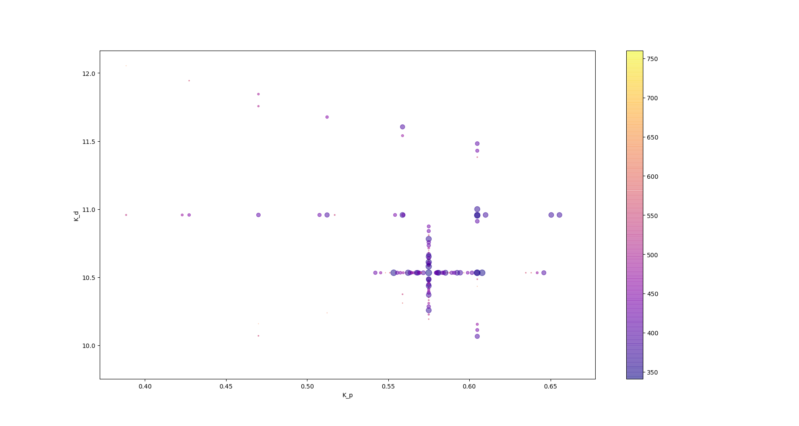

# CarND-Controls-PID
Self-Driving Car Engineer Nanodegree Program

---

## Instructions

### Dependencies

* cmake >= 3.5
* make >= 4.1(mac, linux), 3.81(Windows)
* gcc/g++ >= 5.4
* [uWebSockets](https://github.com/uWebSockets/uWebSockets)
* Simulator. You can download these from the [project intro page](https://github.com/udacity/self-driving-car-sim/releases) in the classroom.

### How to run

1. Clone this repo.
2. Make a build directory: `mkdir build && cd build`
3. Compile: `cmake .. && make`
4. Run it: `./pid`. 

## Description

I used the provided code template and started filling the TODOs.

The implementation of the PID controller is quite straightforward and took little time. I had to just declare new variable `prev_cte` to store the previous value of the cross track error, fill in the function `UpdateError` that updates the proportional, differential and integral error of the controller and at each message from the simulator update the controller based on the provided cross track error and output the desired steering angle.

I changed the order of the arguments for the initialization of the controller to `PID::Init(Kp, Kd, Ki)`, so I guess that makes my controller PDI rather then PID.

I think I first tried setting the parameters to  `Kp = 1, Kd = 1, Ki = 1` and the vehicle almost instantanously drived off the road. I started messing around with the parameters and find out that

* the proportional coefficient is the most important, but if set too high the oscillations can get quickly out of hand
* it is good to have high differential coefficient to supress the oscillations
* the integral term doesn't really matter - probably no systematic error is present in the system

After some manual tuning, I arrived at `Kp = 0.1, Kd = 10, Ki = 0.001`, which was able to drive quite nicely around the track. It was time to deploy twiddle (coordinate descent) algorithm to optimize the parameters.

This turned out to be much harder thing to crack, since the simulator as far as I know doesn't provide any controls of the simulation over the Websocket, I had to be little creative. The final implementation introduces function `UpdateParams` that is called after every some customizable number of controller calls to update the controller parameters according to twiddle and variable `total_error` that contains the cumulative squared cross track error. The duration of the evaluation was set to 5000 steps of the simulator based on the observation from the manual testing. Each evaluation is also preceeded with settling phase pf 100 steps during which the total error is not counted.

I initialized the controller with the hand-chosen combination `Kp = 0.1, Kd = 10, Ki = 0.001` and let it run over night. In the morning I found the drove off the track and was stuck there almost the whole night. I restarted the learning with the best parameters from the night run `Kp = 0.241, Kd = 10.957, Ki = 0.010` and went to work. After return, I found the car again stuck outside. By analyzing the log, I figured out that the experimenting with the integral term made the car unstable. Based on the experience from the manual tuning I decided to omit the integral parameter altogether and just twiddle the proportional and differential parameters. For this purpose, I created new function `UpdateParamsPI`.

I started new session with following combination `Kp = 0.197, Kd = 10.527, Ki = 0` based on best performing candidates from the day run. 

After some time the twiddle was unable to find better parameter combination than `Kp = 0.241, Kd = 10.957, Ki = 0`. So, I used these values as seed for the initialization and ran it again. This time it got stuck on `Kp = 0.353, Kd = 10.957, Ki = 0`. I performed the same thing once more and in this graph you can see the parameters and total error on this last run: 

You can see that the total error is quite noisy, which unable twiddle to converge. The noise is probably caused by the fact that the simulation does not start at the same position every time and that the server might send the messages in different time intervals, hence the individual runs are not identical.

The final parameters from this run are `Kp = 0.57499, Kd = 10.5329, Ki = 0`.

## Conclusion

### Observed behaviour while running the simulator

* vehicle reliably drives around the track
* vehicle quickly corrects its position in turns
* oscillations in the sharpest corner, otherwise without oscillations
* at the end of the bridge the vehicle always turns sharply left - probably some bug in the provided cross track error from the simulator

### Ideas for improvements

* perform grid search in the parameter space to ensure that the twiddle didn't get stuck in some local minima
* the steering is quite jerky - improve smoothness of the controls
* try to implement the PID controller also for the throttle

